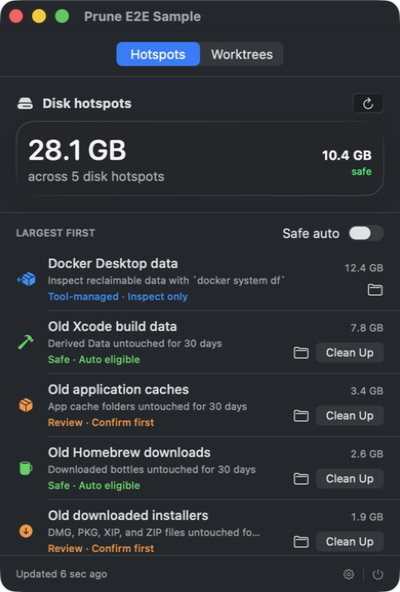

# Prune

**A native macOS menu bar app for finding, understanding, and safely removing Git worktrees.**

Prune shows how much space linked worktrees consume, connects branches to their GitHub pull requests, and makes finished work easy to clean without losing local changes.

<p align="center">
  
</p>

> The screenshot uses deterministic fixture data. It contains no real repositories, branches, paths, or pull requests.

## Why Prune?

Worktrees are useful, but they quietly accumulate dependencies, build output, and gigabytes of duplicated files. Remembering which branch belongs to which PR—and whether it is safe to remove—is the tedious part.

Prune keeps those signals together:

- disk space used by every linked worktree;
- current Git status and local-change count;
- draft, open, closed, and merged GitHub PR status;
- exact merged-head verification;
- guarded cleanup through Git's native worktree commands.

## Highlights

- **Native macOS experience** — SwiftUI `MenuBarExtra`, Liquid Glass on macOS 26, and native material fallbacks on macOS 14–15.
- **Progressive scanning** — worktrees appear immediately while bounded background jobs calculate sizes.
- **Stable scrolling** — rows do not reorder or flicker while a sync is running.
- **GitHub-aware readiness** — a worktree becomes ready when its PR is merged at the checked-out `HEAD`.
- **Local-work protection** — modified, staged, deleted, and untracked files are always reported separately from PR state.
- **Stash & Clean Up** — merged worktrees with local changes can be backed up with `git stash --include-untracked` before removal.
- **Optional automation** — Auto cleanup rechecks GitHub and removes only locally clean merged-PR worktrees. It never auto-stashes.
- **Manual escape hatch** — clean linked worktrees without a merged PR can be reviewed from the three-dot menu.
- **Open anywhere** — detects installed copies of Visual Studio Code, Zed, and Cursor.
- **Main checkout protection** — the primary repository checkout is never treated as a removable worktree.

Prune never uses `git worktree remove --force`.

## Requirements

- macOS 14 or newer
- Apple Command Line Tools with Swift 6.2 or newer
- Git at `/usr/bin/git`
- [GitHub CLI](https://cli.github.com/) for pull-request status

Install and authenticate GitHub CLI if needed:

```sh
brew install gh
gh auth login
```

## Build and run

### Download

Every successful GitHub Actions run produces a universal **Prune-macOS** build for both Apple Silicon and Intel Macs. Open the run's **Artifacts** section, download it, extract `Prune-macOS.zip`, and move `Prune.app` to Applications.

Version tags such as `v0.1.0` automatically publish the same zip and its SHA-256 checksum on the [Releases page](https://github.com/Parassharmaa/prune/releases), providing a public download that does not expire with CI artifact retention.

The app is currently ad-hoc signed rather than notarized. On first launch, macOS may require **Control-click → Open**. Developer ID signing and notarization are planned before stable distribution.

### Build locally

```sh
git clone https://github.com/Parassharmaa/prune.git
cd prune

scripts/build-app.sh release
open .build/Prune.app
```

The build script creates an ad-hoc signed local app bundle. Full Xcode is not required for local development, but Developer ID signing and notarization will require it before distribution.

Create the same universal download archive used by CI:

```sh
scripts/package-app.sh
```

This writes `.build/dist/Prune-macOS.zip` and a matching `.sha256` checksum.

On first launch:

1. Prune starts with your macOS **Home**, **Desktop**, **Documents**, and **Downloads** locations.
2. Open **Settings** from the gear icon to add or remove scan folders.
3. These locations are resolved through macOS APIs—there are no machine-specific hardcoded filesystem paths.
4. Overlapping locations are scanned only once, and an intentionally empty folder list stays empty.
5. Authenticate `gh` if GitHub status is unavailable.

## Cleanup safety

### Clean merged worktree

Prune rechecks Git registration, lock state, local status, submodules, and PR `HEAD`, then runs:

```sh
git worktree remove -- <path>
```

### Merged worktree with local changes

The explicit **Stash & Clean Up** flow:

1. creates a labelled stash including untracked files;
2. verifies that a new stash exists;
3. verifies that the checkout became clean;
4. removes the linked worktree;
5. keeps the local branch and recovery stash intact.

If removal fails after stashing, Prune reports the preserved stash commit.

### Auto cleanup

Auto is off by default and persisted locally. It runs only after a complete scan and only for worktrees that are:

- linked rather than main checkouts;
- locally clean;
- unlocked and structurally valid;
- associated with a merged PR at the exact current `HEAD`;
- freshly rechecked against GitHub immediately before removal.

Local changes are never stashed automatically.

## Development

Build the Swift package:

```sh
swift build
```

Run dependency-free integration checks:

```sh
scripts/test.sh
```

The tests create disposable repositories and real linked worktrees to verify parsing, main-checkout protection, dirty-state rejection, stash recovery, and clean removal.

Measure scan latency against a folder:

```sh
scripts/benchmark-scan.sh ~/Projects
```

## Safe native E2E fixtures

Launch the real SwiftUI interface with deterministic sample data and a fake cleanup backend:

```sh
scripts/run-e2e-sample.sh
```

Exercise auto cleanup against the same non-destructive backend:

```sh
scripts/run-e2e-auto-sample.sh
```

The assertions are documented in [`Tests/E2E/INLINE_CLEANUP.md`](Tests/E2E/INLINE_CLEANUP.md). Sample mode cannot invoke Git or remove a real folder.

## Project structure

```text
App/                    App bundle metadata
Sources/Prune/App/      Application state and sample fixtures
Sources/Prune/Core/     Worktree and PR domain models
Sources/Prune/Services/ Git, GitHub, disk, cleanup, and IDE integrations
Sources/Prune/Views/    Native SwiftUI and Liquid Glass interface
Tests/SelfTest/         Dependency-free integration checks
Tests/E2E/              Native sample scenarios
Tools/                  Scan benchmarking utility
scripts/                Build, validation, and E2E commands
.github/workflows/      CI, universal packaging, and tagged releases
```

## Privacy

Prune runs locally. It does not upload repository contents or include analytics, and it scans only the folders visible in Settings. GitHub status is queried through the user's existing authenticated `gh` session.

## Status

Prune is an early macOS utility under active development. Planned work includes background notifications, per-repository automation policies, grace periods, Developer ID signing, notarization, and automatic updates.
